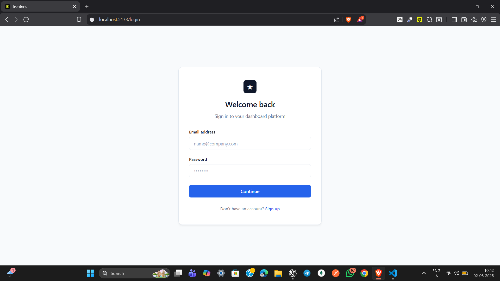
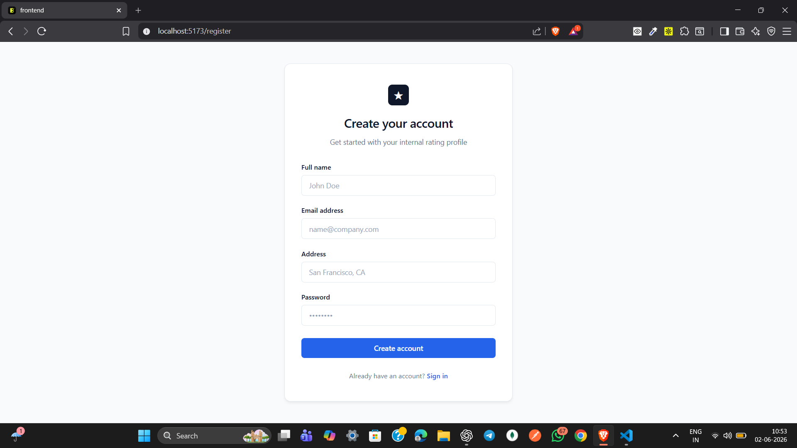
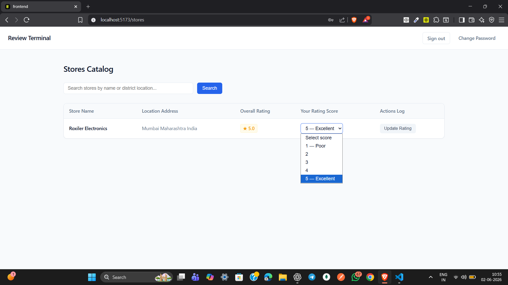

# Roxiler Store Rating Platform

A full-stack store rating platform built using React.js, Express.js, PostgreSQL, and JWT Authentication.

The application enables users to discover stores, submit and manage ratings, while providing dedicated dashboards for administrators and store owners through a secure role-based access control system.

### Key Features

- JWT-based Authentication & Authorization
- Role-Based Access Control (Admin, User, Store Owner)
- Store Rating Management
- Admin Dashboard with Analytics
- User & Store Management
- Store Owner Rating Insights
- Search, Filtering & Sorting
- Responsive Modern UI

Built as part of the Roxiler Systems Full Stack Intern Coding Challenge.

---

## Application Screenshots

### Login Page



### Register Page



### Admin Dashboard


### User Management


### Store Management


### Store Rating Interface



### Store Owner Dashboard


---

## Live Features

The platform supports three user roles:

### System Administrator

- Login securely using JWT authentication
- View dashboard statistics
  - Total Users
  - Total Stores
  - Total Ratings
- Add new users
- Add new stores
- View all users
- View all stores
- Search users and stores
- Sort users and stores
- View detailed user information
- Change password
- Logout securely

### Normal User

- Register a new account
- Login securely
- Browse all stores
- Search stores by name or address
- View overall store ratings
- View personal submitted ratings
- Submit ratings (1–5)
- Modify previously submitted ratings
- Change password
- Logout securely

### Store Owner

- Login securely
- View average rating of owned store
- View users who submitted ratings
- Change password
- Logout securely

---

## Tech Stack

### Frontend

- React.js
- React Router DOM
- Axios
- CSS3

### Backend

- Node.js
- Express.js
- JWT Authentication
- bcrypt.js

### Database

- PostgreSQL

---

## Project Structure

### Frontend

```bash
frontend/
│
├── src/
│   ├── components/
│   ├── context/
│   ├── pages/
│   ├── routes/
│   ├── services/
│   ├── App.jsx
│   └── main.jsx
│
└── package.json
```

### Backend

```bash
backend/
│
├── src/
│   ├── config/
│   ├── controllers/
│   ├── middleware/
│   ├── routes/
│   ├── services/
│   ├── utils/
│   ├── app.js
│   └── server.js
│
└── package.json
```

---

## Database Design

### Users Table

Stores all platform users.

Fields:

- id
- name
- email
- password
- address
- role

Roles:

- ADMIN
- USER
- STORE_OWNER

---

### Stores Table

Stores information about registered stores.

Fields:

- id
- name
- email
- address
- owner_id

---

### Ratings Table

Stores ratings submitted by users.

Fields:

- id
- user_id
- store_id
- rating

Important Constraint:

```sql
UNIQUE(user_id, store_id)
```

This ensures that one user can rate a store only once and update their rating later.

---

## Authentication & Authorization

Authentication is implemented using JSON Web Tokens (JWT).

Protected routes are secured through middleware.

Role-based access control is implemented for:

- Admin
- User
- Store Owner

Unauthorized access is blocked at the API level.

---

## Form Validations

### Name

- Minimum 20 characters
- Maximum 60 characters

### Email

- Standard email validation

### Address

- Maximum 400 characters

### Password

- 8–16 characters
- At least one uppercase character
- At least one special character

---

## API Overview

### Authentication

```http
POST /api/auth/register
POST /api/auth/login
PUT  /api/auth/change-password
```

### Administrator

```http
GET  /api/admin/dashboard
GET  /api/admin/users
GET  /api/admin/users/:id
GET  /api/admin/stores

POST /api/admin/users
POST /api/admin/stores
```

### Stores

```http
GET /api/stores
```

### Ratings

```http
POST /api/ratings/:storeId
PUT  /api/ratings/:storeId
```

### Store Owner

```http
GET /api/store-owner/dashboard
```

---

## Installation

### Clone Repository

```bash
git clone <repository-url>
```

---

### Backend Setup

```bash
cd backend

npm install
```

Create a `.env` file:

```env
PORT=5000

DB_HOST=localhost
DB_PORT=5432
DB_USER=postgres
DB_PASSWORD=your_password
DB_NAME=roxiler_db

JWT_SECRET=your_secret_key
```

Run backend:

```bash
npm run dev
```

---

### Frontend Setup

```bash
cd frontend

npm install

npm run dev
```

---

## Development Highlights

- Clean layered architecture
- Service-based backend structure
- JWT-based authentication
- Role-based authorization
- PostgreSQL relational schema design
- Reusable React components
- Responsive user interface
- Search, filtering and sorting support
- Secure password hashing using bcrypt
- Separation of concerns across controllers, services and routes

---

## Future Improvements

Potential enhancements:

- Pagination
- Email verification
- Forgot password flow
- Profile management
- Store analytics dashboard
- Unit testing
- Integration testing
- Docker deployment
- CI/CD pipeline

---

## Author

**Vikash Mishra**

Full Stack MERN Developer

GitHub:
https://github.com/Vikash-Mishra06

LinkedIn:
https://www.linkedin.com/in/vikash-mishra1206

---

Thank you for reviewing this submission.